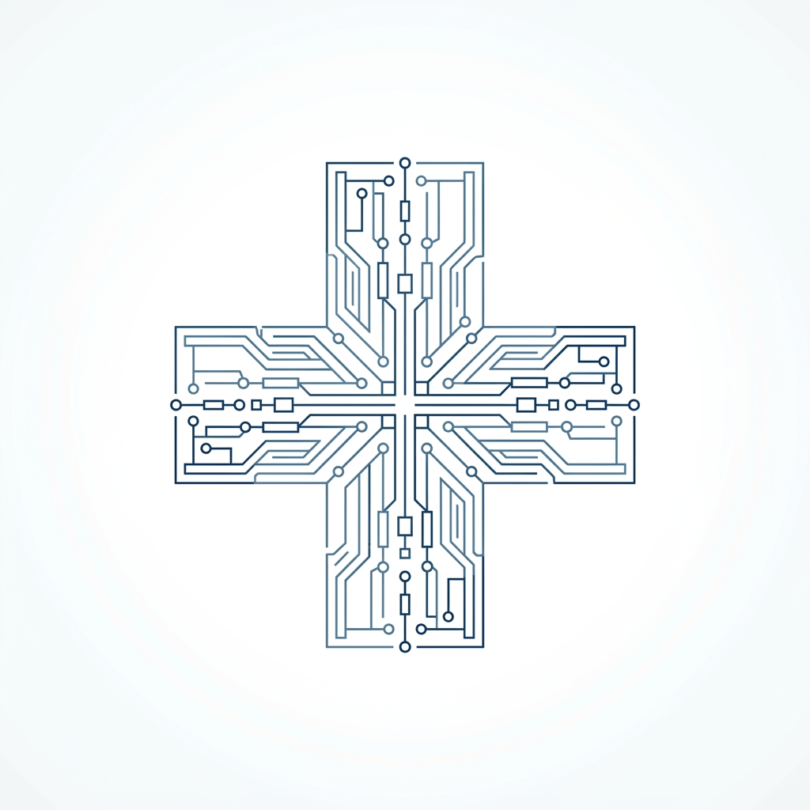

<div align="center">
  
  <h1>ClinicaDiff</h1>
  <p><strong>Architecting the future of healthcare with Neural Intelligence.</strong></p>
  <p>Real-time diagnostics, drug interaction analysis, and seamless patient-doctor collaboration — all in one AI-powered platform.</p>

  [](https://opensource.org/licenses/MIT)
  [](https://nextjs.org/)
  [](https://tailwindcss.com/)
  [](https://nodejs.org/)
  []()
</div>

<hr />

## 🚀 The Vision
Healthcare is fragmented. Doctors suffer from burnout due to heavy documentation, and patients lack unified access to their diagnostic history, medication adherence, and timely care. **ClinicaDiff** bridges this gap. We've built an **Enterprise Medical Intelligence OS** that serves as a seamless bridge between patients and healthcare providers, supercharged by multimodal AI.

---

## ⚡ Core Features

### 🎙️ Voice AI Copilot (Hands-Free Dictation)
Doctors can ditch the keyboard. Using real-time speech recognition and advanced LLM structuring, clinical notes are transcribed and structured automatically during patient consultations.

### 👁️ Neural Vision OCR
Instantly transcribe messy, handwritten prescriptions into structured, analyzable data. Powered by cutting-edge vision models.

### 📸 Multimodal Diagnosis
Patients can upload images of physical symptoms (e.g., rashes, wounds) alongside text descriptions. Our underlying inference engine cross-analyzes the data to suggest probable conditions.

### 🧠 Bio-Sync Inference & Symptom Analyzer
Universal symptom analyzer that screens for multiple conditions globally. Cross-references patient symptoms with their medical history to provide early-warning triage.

### 🤝 Real-Time Clinical Collaboration
- **Instant Booking**: Patients can request appointments with real-time WebSocket notifications instantly alerting the doctor's dashboard.
- **Adherence Coach**: Built-in pill reminders and adherence tracking to ensure patients never miss a dose.

---

## 🛠️ Technical Architecture

### Frontend (The Cinematic Medical OS)
- **Framework**: Next.js 15 (React)
- **Styling**: Tailwind CSS & Glassmorphism UI tokens
- **Animations**: Framer Motion (Custom Antigravity Physics Engine for the landing page)
- **Icons**: Lucide React

### Backend (The Neural Core)
- **Runtime**: Node.js & Express
- **Real-Time Engine**: Socket.io (for instant appointment and case updates)
- **Database**: MongoDB (Mongoose schemas for Users, Appointments, Copilot Briefs, Cases)
- **AI Integrations**: Groq & Gemini Vision APIs for blazing-fast inference and OCR.

---

## 🏎️ Getting Started

### Prerequisites
- Node.js (v18+)
- MongoDB (Local or Atlas)
- API Keys (Groq / Gemini)

### 1. Clone the repository
```bash
git clone https://github.com/bhaveshdamani5-crypto/clinicadiff.git
cd clinicadiff
```

### 2. Setup the Backend
```bash
cd backend
npm install
```
Create a `.env` file in the `backend` directory:
```env
PORT=5000
MONGO_URI=your_mongodb_connection_string
JWT_SECRET=your_jwt_secret
GROQ_API_KEY=your_groq_api_key
GEMINI_API_KEY=your_gemini_api_key
```

### 3. Setup the Frontend
```bash
cd ../frontend
npm install
```
Create a `.env.local` file in the `frontend` directory:
```env
NEXT_PUBLIC_API_URL=http://localhost:5000
```

### 4. Run the Application (Windows)
You can use the provided batch script to launch both services simultaneously:
```bash
.\run.bat
```
*(Alternatively, run `npm start` in the backend and `npm run dev` in the frontend separately).*

---

## 🎨 Design Philosophy
ClinicaDiff abandons the sterile, outdated look of traditional hospital software. We employ a **High-Fidelity, Cinematic SaaS Aesthetic**:
- **Glassmorphism**: Frosted glass effects for a premium, lightweight feel.
- **Dynamic Micro-Interactions**: Hover states, smooth page transitions, and a 2D antigravity particle network on the landing page.
- **Deep Medical Palette**: Tailored HSL colors relying on clinical blues (`#3B82F6`) and vibrant cyans (`#06B6D4`).

---

<div align="center">
  <b>Built to win the Prompt Wars Hackathon. 🏆</b>
</div>
